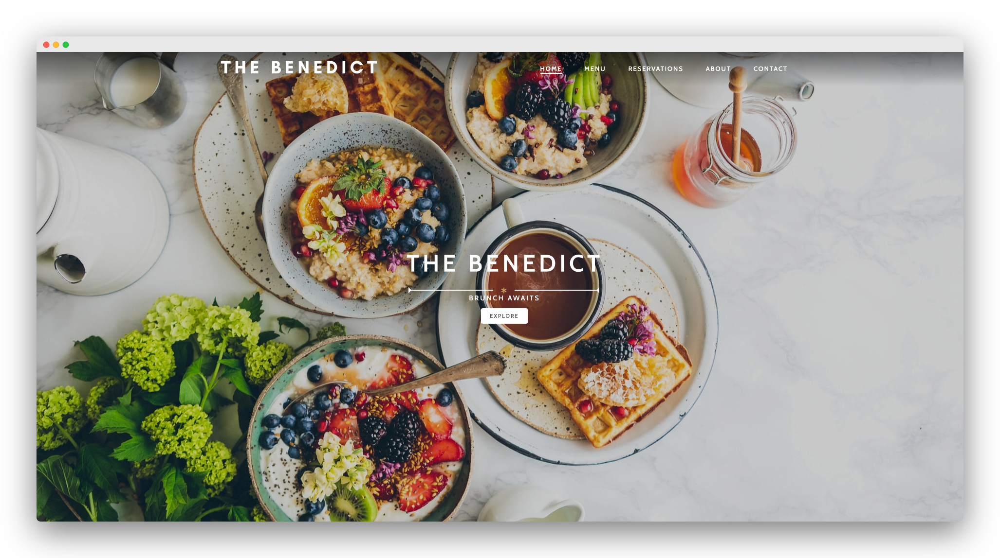

# the-benedict
A mobile responsive website without the use of library frameworks. This site includes animation on scroll to create a more dynamic page. I followed this tutorial: [link](https://youtu.be/FZQxPTV3cFk) and changed some features to fit the overall theme of the restaurant.

View the web page: [link](https://tracynle.github.io/the-benedict/)

